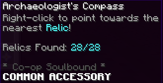

# skyblock0.16.1更新速递


本文编辑于0.16.1版本


>)

Hello,\
大家好！\
Every now and then islands need to be improved to the new standards, today it's the Spider's Den!

岛屿时不时都需要更新到新标准，今天轮到了蜘蛛岛！\
Oh, and there is a new Mayor in town.\
另外，城镇出现了一位新的市长候选人\
**► Spider's Den QoL**\
The Spider's Den is now the only combat island before the End, therefore we needed to make its content more early game so new players have more content before they reach combat level 12.\
蜘蛛岛是目前在末地前唯一的战斗岛屿，因此我们需要让他更合前期玩家，以便于新玩家在战斗12级以前有更多的游戏内容可供体验。\
**Arachne Changes**

Arachne 改动\
The main takeaway is that Arachne, her Brood and her Keepers, are now a LOT easier to fight. Here's the list of the changes:

主要削弱了Arachne，以及它的幼虫与守卫，现在战斗难度大大降低了。

以下是改动列表\
Arachne(s), Arachne's Brood and Arachne Keepers now have:

Arachne，Arachne的幼虫和Arachne的守卫现在有：

* Much less health
* 更少的生命值
* Much less damage
* 更低的伤害
* Poison tics more often but deals way less damage
* 中毒效果更加普遍但是伤害低得多
* Have improved basic drops (coins, combat exp, strings and eyes)
* 有更多的基础掉落物（硬币，战斗经验，线与蜘蛛眼）
* New voicelines
* 新的对话(我变弱了，但我变骚了)
* No more cobwebs spawn from the boss itself
* Boss附近不再生成蜘蛛网
* Beating Arachne grants 8 and 30 Spider Essence respectively
* 击败不同等级的Arachne分别获得8/30蜘蛛精粹
* Arachne's Keepers have 6 new spawn point (previously 3) and spawn a lot more often.
* Arachne的守卫现在有六个新刷新点(以前是三个)，而且刷新更频繁了。
* Arachne's Keeper Fragments are now called Arachne's Calling, and have a better description.
* Arachne's Keeper Fragments（Arachne的守卫碎片）被更名为Arachne's Calling（Arachne的呼唤），并且
* Dark Queen's Soul Drop is now simply called Dark Queen's Soul.
* Dark Queen's Soul Drop（黑暗女王灵魂之遗）更名为（黑暗女王的灵魂）

On top of that we added a new Armor Set and a new Sword, for early game:

此外我们添加了一套新的护甲和新的剑，为前期游戏。

>)

\
Arachne's Armor has an **8 Set Bonus**, once you wear all 8 pieces, you gain an extra 100 Health and Defense, quite decent early game!

Arachne护甲有满8件加成：获得100点血量和生命，在前期很不错。\
The Armor Pieces are dropped by Arachne, while the equipments are dropped by the Keepers.

这套护甲的每一件都掉落自Arachne，饰品的每一件都掉落自他的守卫。\
This armor is quite easy to obtain, therefore it is soulbound!

这套护甲太容易获得了，所以他是灵魂绑定的。

 (2)>)

\
**Arack** is a new early game sword obtained from Arachne

Arack 是从Arachne获取的一个新的前期武器。

The boss also has a chance to drop **Arachne's Fang**, an item needed to upgrade the Vaccine Talisman into it's ring form.\
这个boss也有概率掉落 Arachne’s Fang，是用于将疫苗护身符升级为疫苗指环的物品。\
Both Arachne's Armor and Sword are now in the museum, as long as the Void Sword and Dragon Shortbow from the previous update.\
Arachne的护甲与剑现在都添加到了博物馆中，之前更新的Void Sword与龙短弓也如此。\
**Spider Tamer**

>)

\
This man loves spiders, but hates Arachne...

他喜欢蜘蛛，但是痛恨Arachne...

>)

The Spider Essence shop features 4 new perks, and a Travel Scroll.

新的蜘蛛精粹商店有四个新的加成，和一个传送卷轴

* Empowered Agility reduces the mana cost of movement abilities.
* Empowered Agility减少了移动能力的法力消耗
* Vermin Control reduces your damage taken by spiders.
* Vermin Control减少了蜘蛛对你的伤害
* Bane increases your damage towards spiders.
* Bane增加你对蜘蛛的伤害
* Spider Training increases your Combat Wisdom while in the Spider's Den.
* Spider Training增加了你在蜘蛛岛的Combat Wisdom(增加战斗经验获取)

\
**Other changes**

**其他更新**

**Shaggy**

\
This NPC was a little bit too mysterious before.

这个NPC以前过于神秘了\
Shaggy now gives players simple scoreboard objectives to better guide players through the island content.

Shaggy现在给玩家正常的计分板目标，同时更好的引导玩家体验这个岛屿的内容。

**The Archeologist gives a new accessory**

\
This item is there to help players find all the relics on their own.

这个物品帮助你独自找到所有的Relic\
And if you happen to lose your compass fear not, Rusty will find it!\
你要是丢了火速去找Rusty。\
**Bow balancing**

弓箭平衡\
Spider's Queen Stinger now has double damage (it simply doubles the damage of its ability)

Spider's Queen Stinger现在有双倍的伤害（它只是将其能力的伤害加倍）\
Venom's Touch damage is buffed from 200 to 250, and the starred version is buffed from 300 to 370 damage.\
Venom's Touch的伤害从200提升到了250，他的进阶版本从300提升到了370\
**New areas names**

新区域名称\
Each main point of interest of the Spider's Den now has its own official area name.

蜘蛛岛的每个主要地点现在都有自己的官方区域名称。\
**Thunderstorms**

**雷暴**

\
The Spider's Den has always had a weather system, but now each rain has a chance to be a Thunderstorm.

蜘蛛岛以前就有一个天气系统，现在每次雨都可能成为雷暴。\
Thunderstorms show a little lightning on the scoreboard and have the particularity of spawning giant Toxic Slimes, which have a chance to drop a new item, the **Poison**

**Sample**.\
在雷暴期间，计分板上会显示一个雷电符号，并且会生成巨型的Toxic Slime，概率掉落新物品Poison Sample\
On top of that, Rain on the Spider's Den now grants 50 extra Fishing Speed, and Thunderstorm grant an extra 3 Sea Creature Chance.

此外，在蜘蛛岛下雨期间，额外获得50钓鱼速度，在雷暴期间额外给予3SCC

**Vaccine ring and artifact**\
The Vaccine Talisman now only reduces poison by 10%, however it now works on Arachne's Venom.

Vaccine Talisman现在指减少10%中毒效果,但是也工作于Arachne’s Venom。\
It also has 2 new tiers:

并且有了两个新的等级\
The Vaccine Ring can be crafted from the Talisman, with 8 Arachne's Fangs

Vaccine Ring可以从Vaccine Talisman升级，用8个Arachne’s Fang.\
The Vaccine Artifact can be crafted from the Ring, with 8 Poison Samples\
Vaccine Artifact可以从Vaccine Ring升级，用8个Poison Samples\
**Promising shovel**

进阶铲子\
This item is now slightly more useful.

这件物品目前可能更实用了

On top of obtaining all the way up to Efficiency X, it now has a chance to drop double flint, up to 10%.

除了最终可以得到效率X之外，它现在还有机会掉落双燧石，最高可达10%。

**► Finnegan**

\
Finnegan is a new regular Mayor, he's a close friend to Jacob as you probably noticed.\
Finnegan是一个普通市长，正如你所见他是Jacob的好朋友。\
**► Bug Fixes**

* Fixed the Builder NPC having some items twice
* 修复Builder NPC可能有两个相同的出售物品的问题。
* Fixed the Shredder not activating some autopet rules.
* 修复了Shredder未激活某些自动宠物规则的问题。
* Fixed being able to update signs while muted.
* 修复了禁言时可以写告示牌的问题
* Changed the recipe of the Terminator bow so everyone can craft it (same amount of items)
* 调整了Terminator弓的配方，便于各位制作。
* 编者语：配方需求不变，但是把Null Blade的位置改变了，以前三个Null Blade放在一起，而Null Blade的原版材质为剪刀，显然三个剪刀叠不到一起，所以以前没有一把term是从合成台拿下来的，都是从Quick Craft拿出来的。

\
**► A note on future updates**\
As usual, we wanted to give you guys a quick glimpse on what's in the pipeline for Skyblock. Please note that anything we talk about is subject to change (or may not even release!).

像往常一样，我们想让你们快速了解一下Skyblock的计划。请注意，我们谈论的任何内容都会发生变化（甚至可能不会发布！）。

（编者语：老鸽子了）

**Kuudra Tier 5**\
Kuudra Tier 5 is about ready to release, and should be expected in a week or two.\
Kuudra T5的更新，一两周内实装！

\
**Winter Island QoL**\
We are considering improving a few aspects of the Jerry Island. Details on this will come up at a later date (or with it's release).\
冬季岛QoL

我们正在考虑改善Jerry岛的几个方面。有关这方面的详细信息将在稍后的日期（或发布时）公布。（是不是这玩意儿不一定更新，Jerry岛不就没啥东西吗还怎么QoL，连怪都没有怎么Qol用Ice ess）

\
**Garden Update (part 1)**\
This update encountered some technical difficulties during Alpha testing (which is why we alpha tested to begin with), and we do not believe that it'll be ready for the next release, therefore it _should_ release early 2023. We're sorry for the delay!

花园更新（第1部分）

此更新在Alpha测试期间遇到了一些技术困难（这就是为什么我们开始测试Alpha的原因），我们不相信它会为下一个版本做好准备，因此它应该在2023年初发布。我们对延迟表示抱歉！

**SkyBlock Levels follow up**\
A follow up update to SkyBlock Levels is coming up soon, and has reached later stages of development. It should arrive on Alpha in the next few weeks.

SkyBlock等级后续更新

SkyBlock Level的后续更新即将推出，并已进入后期开发阶段。它应该在未来几周内上线测试服。

**Wizard Portal**\
While there is still a big chunk of work to do, we are getting confident with an early 2023 release.

巫师的传送门

尽管仍有大量工作要做，但我们对2023年初发布充满信心。

**Garden Update (part 2)**\
There will be more to The Garden at some point after it's release, but it is very much too early to say how much, or when.

花园更新（第2部分）

花园在发布后的某个时候会有更多的内容，但现在说会整啥花活还为时过早。

**Foraging update**\
We will have more to talk about with the Foraging Update when we release our final 1.0 content thread. Until then, we are not at a point where we can reveal much about the update just yet.

伐木更新

当我们发布最终的1.0内容的帖子，我们将有更多关于Foraging Update的内容可以公布。在那之前，我们还不能透露更多关于更新的信息。

As always, take these previews with a grain of salt - a lot of it is subject to change. We are trying to be more transparent about what we're working on, but we also don't want to lock ourselves away from letting creativity take control. Only time will tell.

和往常一样，对这些预告持谨慎态度——其中很多都会(fang)发(ni)生(ge)变(zi)化。我们正在努力让我们的工作更加透明，但我们也不想让自己的创造力被控制。只有时间才能说明问题。

\
**Credits**:\
[@aPunch](https://hypixel.net/members/45616/) - Spider's Den QoL

aPunch:蜘蛛岛QoL更新\
[@Minikloon](https://hypixel.net/members/287602/) - New Mayor

迷你恐龙：新的市长\
[@Bloozing](https://hypixel.net/members/63600/), [@Citria](https://hypixel.net/members/814928/), HPC and QA Team - Testing/QA

Bloozing，Citria，HPC和QA团队：测试与反馈\
[@Jayavarmen](https://hypixel.net/members/30478/) - Game Design

Jayavarmen：游戏设计

Mayor Finnegan was designed by a nerd team member [@Stuffy](https://hypixel.net/members/893751/)!\
Remember that this list is not exhaustive. Developers on this list are often working on other projects.\
Finnegan市长是由nerd团队成员@Stuffy设计的！

请记住，此列表并非详尽无遗。此列表中的开发人员通常在从事其他项目。

\
Thanks for reading! And many thanks for continuing to report issues as we try and work our way through them. A special thanks to the players who helped in the testing and design of this update!

感谢您的阅读！非常感谢在我们努力解决问题的过程中继续报告问题。特别感谢在此更新的测试和设计中提供帮助的玩家！
